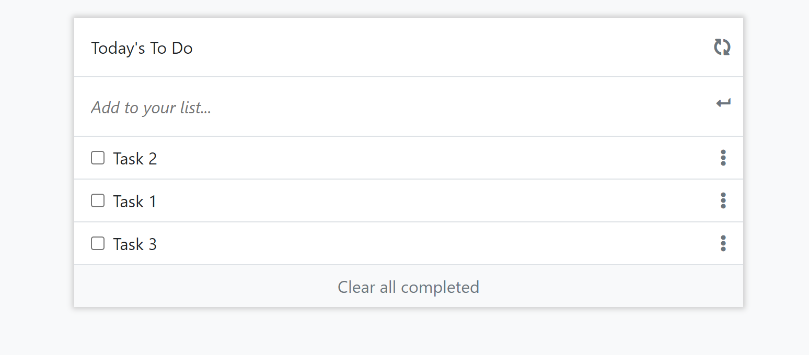

# To-Do List

> This is a to-do list website that adds and removes tasks 

### Milestone 1:

- Set up project with webpack
- Create basic HTML UI
- Use a function to iterate over tasks
- Add basic styling

### Milestone 2:

- Add drag and drop javascript files
- Add methods for status updates
- Import new files as modules
- Add event listeners to list items
- Make object values update based on index and completed tasks
- Add strikethrough styling
- Store items in local storage

## Built With

- HTML, SCSS, Bootstrap, Webpack, Javascript

## Live Demo

[Live Demo Link](https://raw.githack.com/Ghiftee/To-do-list/Interactive-list/dist/index.html)

## Getting Started

To get a local copy up and running:

You should have basic knowledge of HTML, Webpack, Javascript, a text editor and chrome browser.

## Authors

👤 **Author1**

- GitHub: [@Ghiftee](https://github.com/ghiftee)
- Twitter: [@Ghiftee](https://twitter.com/i_ghiftee)
- LinkedIn: [Ghiftee](https://linkedin.com/in/giftuwhubetine)

## 🤝 Contributing

Contributions, issues, and feature requests are welcome!

Feel free to check the [issues page](../../issues/).

## Show your support

Give a ⭐️ if you like this project!

## 📝 License

This project is [MIT](./MIT.md) licensed.
